






<a href="https://godi-globe.vercel.app"></a>

  

<a href="https://aicalc-frontend.vercel.app"></a>

  

<a href="https://github.com/AK01177/Argus"></a>

  




  


Plain-text summary (for screen readers &amp; search)

 

**Aryan Ranavat** is a junior B.Tech ICT student at DA-IICT (Dhirubhai Ambani University), Gandhinagar, interested in full stack development, system design and machine learning. He solves problems in C++ and builds projects with TypeScript, Python, React and FastAPI, and is looking for software engineering internships and placements.

**Projects**
- **[GodiGlobe](https://github.com/AK01177/GodiGlobe)** ([live](https://godi-globe.vercel.app)): a full-stack news explorer that maps global headlines onto an interactive 3D globe, with country and state drill-down, background-refreshed caching and URL-based deduplication. React, Vite, Tailwind CSS, FastAPI, SQLAlchemy, SQLite.
- **[AICalc](https://github.com/AK01177/AICalc)** ([live](https://aicalc-frontend.vercel.app)): draw math, physics and chemistry problems on a canvas and get AI-solved results rendered in LaTeX. Powered by Gemini 2.5 Flash; built with React, TypeScript and FastAPI.
- **[Argus](https://github.com/AK01177/Argus)**: an AI-powered codebase companion, in development. Full stack with Docker Compose.

**Achievements**
- 2026: Goldman Sachs India Hackathon, advanced to the interview round
- 2025: Google Agentic AI Day Hackathon, invited on-site at BIEC Bengaluru
- 2025 &amp; 2026: Tic Tech Toe Hackathon, on campus at DAU

**Stack:** C++, Python, TypeScript, JavaScript, SQL · React, FastAPI, Node.js, Tailwind CSS, Vite · Git, Vercel, Render, Linux

